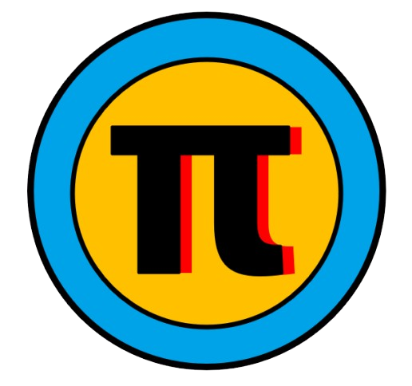
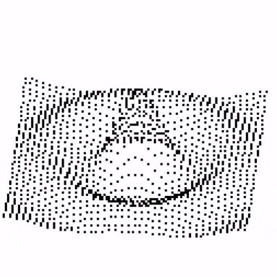
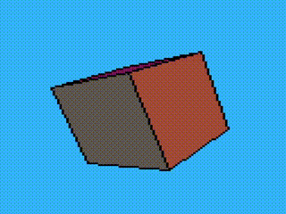
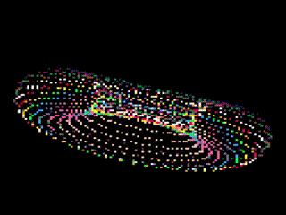
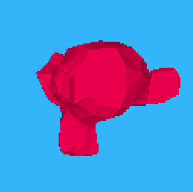

<p align="center">
  
</p>

# &pi; Piscript

**Piscript** (Pixel Script) is a lightweight, embeddable scripting language inspired by Python, built in C with a focus on simplicity, performance, and retro-style graphics. It's designed for educational and creative coding use cases, running inside a 128x128 pixel virtual environment.

---

<p align="center">

 &nbsp;

 &nbsp;

&nbsp;

 &nbsp;
</p>

## 🚀 Features

- Simple, Python-like syntax
- Custom virtual machine with support for:
  - Variables, functions, and control flow
  - Functional programming (map, filter, reduce, compose)
  - Matrix operations (dot, cross, multiply)
- Compact 128x128 screen with SDL2 rendering
- Web support via Emscripten
- Minimal graphics API (`draw()`, pixel plotting, color palette)
- Playground-ready and embeddable in web apps
- built-in 3D graphics engine (works with .obj files)

---

## 📦 Getting Started

### 🔧 Requirements

- C compiler (GCC or Clang)
- [SDL2](https://www.libsdl.org/)
- [Emscripten](https://emscripten.org/) (optional, for WebAssembly)

### 🛠️ Build Instructions

#### Native (Linux/macOS/Windows):

```bash
git clone https://github.com/rolandbrake/piscript.git
cd piscript
make release       # For optimized build
make debug         # For debugging
make emscripten    # For browser build
make run           # To run release
make clean         # To clean
./pi run test.pi        # Run the interpreter
```

---

## 🧪 Example

```javascript
// Piscript Example
clear(12)
for y in 0..127
    for x in 0..127
        if ((x + y) % 10 == 0)
            pixel(x, y, 6)

draw()

```

Run this in the Piscript playground [https://piscript.netlify.app/playground](https://piscript.netlify.app/playground) or native app to draw diagonal lines.

---

## 📚 Documentation

you can check the Documentation at [https://piscript.netlify.app/docs](https://piscript.netlify.app/docs)

Or see the `docs/` folder.

---

## 📝 License

This project is licensed under the [MIT License](LICENSE).

---

## 🤝 Contributing

Pull requests are welcome! Please open an issue first to discuss any major changes.

For major contributions, please follow the guidelines in `CONTRIBUTING.md`.

---

## 👤 Author

Made with ❤️ by [Roland Brake](https://github.com/rolandbrake)

---

## 🌍 Links

- Online Playground: [https://piscript.netlify.app/playground](https://piscript.netlify.app/playground)
- Documentation page: [https://piscript.netlify.app/docs](https://piscript.netlify.app/docs)
- Project Page [https://piscript.netlify.app](https://piscript.netlify.app)
