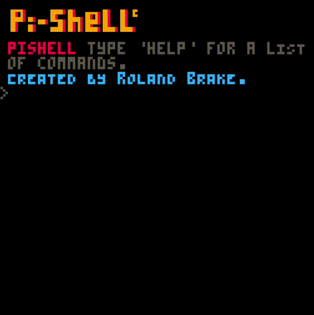
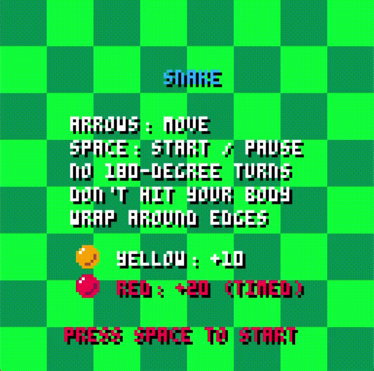

<p align="center">
  
</p>

<h1 align="center">π Pi-Script</h1>

<p align="center">
  <strong>A lightweight, embeddable scripting language for creative coding.</strong><br/>
  Python-inspired • Written in C • Built for retro-style graphics
</p>

<p align="center">
  <a href="https://piscript.netlify.app/">🌐 Website</a> •
  <a href="https://piscript.netlify.app/playground">🎮 Playground</a> •
  <a href="https://piscript.netlify.app/docs">📚 Documentation</a>
</p>

---

## ✨ Overview

**Pi-Script** (Pixel Script) is a lightweight scripting language inspired by Python and implemented in C. It is designed for simplicity, performance, and creative experimentation within a 128×128 pixel virtual environment.

Pi-Script is ideal for:

- 🎓 Educational use
- 🎨 Creative coding
- 🕹 Retro-style graphics experiments
- 🌐 Embeddable web playgrounds
- 🧩 Lightweight scripting integration in C projects

---

<h1 align="center"> Pi-Script In Action </h1>

<p align="center">
  
</p>

Pi-Script makes it easy to create visual experiments, animations, and small interactive programs inside a retro-style virtual console.

---

# 🖥 Pi Shell

<p align="">
  
</p>

**Pi Shell** is the native desktop runtime environment for Pi-Script.

It provides a lightweight development workflow for running Pi-Script locally with:

- 🧠 Interactive script execution
- 📁 File-based project support
- ⚡ Fast native performance
- 🛠 Integrated graphics window
- 🧩 Ideal for game development and experiments

Run scripts directly:

```bash
run <script-name>.pi
```

Pi Shell extends Pi-Script beyond the browser, turning it into a practical creative coding tool for real desktop development.

---

# 🐍 Pi-Script In Action — Snake Game

<p align="">
  
</p>

A complete Snake game built entirely in Pi-Script.

This example demonstrates:

- 🎮 Game loop implementation
- 🕹 Keyboard input handling
- 🧠 State management
- 🎨 Real-time rendering with `pixel()` and `draw()`
- ⚡ Smooth performance inside the 128×128 virtual console

The Snake game proves that Pi-Script is capable of building fully playable retro-style games with clean and minimal code.

Try it in (snake.px):

- 🌐 Online Playground  
- 🖥 Pi Shell (native build)

---

## 🚀 Features

### Language & Runtime
- Clean, Python-like syntax
- Custom virtual machine implemented in C
- Variables, functions, and control flow
- Functional programming utilities:
  - `map`
  - `filter`
  - `reduce`
  - `compose`
- Matrix and vector operations:
  - `dot`
  - `cross`
  - `multiply`

### Graphics
- Fixed 128×128 virtual framebuffer
- SDL2-powered rendering
- Minimal and expressive graphics API:
  - `clear()`
  - `pixel()`
  - `draw()`
- Palette-based color system
- Built-in 3D rendering engine
- `.obj` file support

### Platform Support
- Native builds (Linux, macOS, Windows)
- WebAssembly support via Emscripten
- Embeddable in web applications

---

## 📦 Getting Started

### 🔧 Requirements

- C compiler (GCC or Clang)
- [SDL2](https://www.libsdl.org/)
- [Emscripten](https://emscripten.org/) (optional, for WebAssembly builds)

---

## 🛠 Build Instructions

### Clone the Repository

```bash
git clone https://github.com/rolandbrake/piscript.git
cd piscript
```

### Build Targets

```bash
make release       # Optimized build
make debug         # Debug build
make emscripten    # WebAssembly build
make run           # Run release build
make clean         # Clean build artifacts
```

### Run the Interpreter

```bash
 run test.pi
```

---

## 🧪 Example

```javascript
// Pi-Script example
clear(12)

for y in 0..127
    for x in 0..127
        if ((x + y) % 10 == 0)
            pixel(x, y, 6)

draw()
```

Run this example:

- In the online playground  
  👉 https://piscript.netlify.app/playground  
- Or using the native build via Pi Shell

---