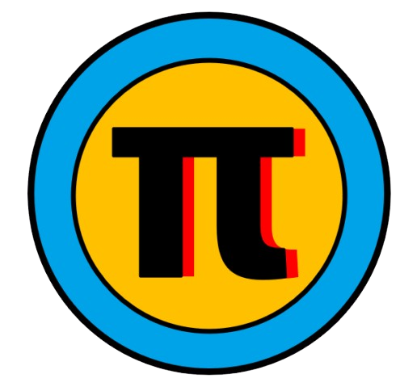
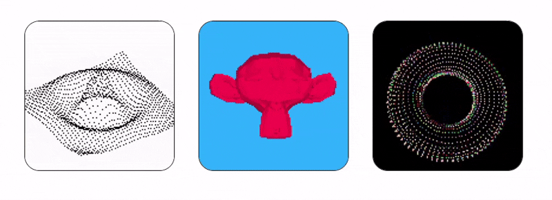

<p align="center">
  
</p>

<h1 align="center">Pi-Script</h1>

<p align="center">
  <strong>A lightweight game scripting runtime for small pixel games and creative coding.</strong><br/>
  Python-inspired - Written in C - SDL-powered graphics, sprites, audio, and scripts
</p>

<p align="center">
  <a href="https://piscript.netlify.app/">Website</a> -
  <a href="https://piscript.netlify.app/playground">Playground</a> -
  <a href="https://piscript.netlify.app/docs">Documentation</a>
</p>

---

## Overview

Pi-Script is a lightweight scripting language and SDL runtime for building
small games, graphics experiments, and interactive tools. It keeps the compact
128x128 framebuffer of a fantasy-console style environment while letting game
projects load normal media files beside their scripts.

Pi-Script projects can combine:

- `.pi` scripts for gameplay, input, animation, and tools
- Pixel drawing, shapes, text, sprites, images, and simple 3D rendering
- PNG files loaded as image objects or sprite objects
- Audio files loaded as sound effects
- Built-in tones and melodies for tiny procedural sounds
- OBJ files for the built-in 3D path

Pi-Script is useful for learning, creative coding, small game prototypes,
native desktop experiments, and embeddable playgrounds.

---

## Pi-Script In Action

<p align="center">
  
</p>

The runtime is small enough for pixel experiments and complete enough for
playable examples such as Snake, Pong, Breakout, Tetris, CHIP-8 experiments,
sprite-driven projects, audio effects, and 3D demos.

---

## Pi Shell

Pi Shell is the native desktop runtime environment for Pi-Script. It provides a
fast local workflow with an SDL graphics window, keyboard input, timing, audio,
and file-backed projects.

Run a script directly:

```bash
run <script-name>.pi
```

The native runtime can load assets relative to the running script, so a game can
live in its own folder instead of depending on the shell working directory.

---

## Features

### Language and Runtime

- Clean, Python-like syntax
- Runtime and virtual machine implemented in C
- Variables, functions, control flow, maps, lists, and ranges
- Keyboard, mouse, timing, logging, and file helpers
- Functional helpers such as `map`, `filter`, and `reduce`
- Matrix and vector operations such as `dot`, `cross`, and `mult`

### Graphics

- Fixed 128x128 framebuffer
- SDL2-powered rendering
- Drawing functions such as `clear()`, `pixel()`, `line()`, `rect()`, `circ()`, `poly()`, and `draw()`
- Text drawing through the screen print APIs
- Named default palette constants such as `COLOR_SOFT_BLACK`, `COLOR_NEON_GREEN`, and `COLOR_SKY_BLUE`
- Arbitrary packed `0xAARRGGBB` colors with alpha blending
- PNG-backed `image()` and `sprite()` loading
- Image operations such as crop, resize, flip, rotate, scale, and copy
- Built-in 3D rendering and `.obj` model loading

### Audio and Assets

- Generated tones and melodies for compact game sound effects
- File-backed sound objects through `sound("assets/hit.mp3")`
- Sprite objects loaded directly from PNG files
- Image objects drawn with `rend2d(...)`
- Script-relative asset lookup for images, sounds, nested scripts, and OBJ models

### Platform Support

- Native builds for desktop use
- WebAssembly support through Emscripten
- Embeddable use in C and browser-facing projects

---

## Getting Started

### Requirements

- C compiler such as GCC or Clang
- SDL2
- SDL2_image
- SDL2_mixer
- Emscripten for WebAssembly builds

### Build

```bash
git clone https://github.com/rolandbrake/piscript.git
cd piscript

make release
make debug
make emscripten
```

The Makefile also provides:

```bash
make run
make clean
```

Run a Pi-Script file with the native build or Pi Shell:

```bash
run test.pi
```

---

## Numbers

Pi-Script supports integer, decimal, base-prefixed, and scientific decimal
number literals. Scientific notation uses an `e` or `E` exponent:

```piscript
let time_step = 10e-2    // 0.1
let tiny = 2.5e-4
let large = 6.02E23
```

---

## Colors

Pi-Script accepts two screen color forms.

Named palette colors are convenient defaults:

```piscript
clear(COLOR_SOFT_BLACK)
rect(8, 8, 48, 32, COLOR_NEON_GREEN, true)
print("palette", 4, 116, COLOR_WARM_YELLOW)
draw()
```

Packed colors use `0xAARRGGBB`:

```piscript
clear(COLOR_SOFT_BLACK)
rect(24, 20, 48, 32, 0x8000ffff, true) // translucent cyan
line(0, 0, 127, 127, 0xffff00ff)        // opaque magenta
pixel(64, 64, 0xffffffff, 0.5)          // extra draw opacity
draw()
```

In a packed color:

- `AA` is alpha
- `RR` is red
- `GG` is green
- `BB` is blue

Values from `0` to `79` still work as legacy palette indices. New examples use
named `COLOR_*` constants or explicit packed colors so the intent is clear.

---

## Game Project Layout

Code and assets can live together:

```text
space-game/
  main.pi
  assets/
    background.png
    player.png
    hit.mp3
    ship.obj
```

Relative asset paths are resolved from the running `.pi` file when they are not
already found from the current working directory:

```piscript
background = image("assets/background.png")
player = sprite("assets/player.png")
hit = sound("assets/hit.mp3")

clear(COLOR_SOFT_BLACK)
rend2d(background, 0, 0)
sprite(player, 56, 56)

if key("SPACE", true)
    play(hit)

draw()
```

Use `image(...)` when you want an image object for `rend2d(...)` and image
operations. Use `sprite(...)` when you want a PNG converted into a sprite
object for the sprite drawing API. `load3d(...)` follows the same relative path
behavior for OBJ models.

---

## Small Example

```piscript
player = sprite("assets/player.png")
x = 56
y = 56

while true {
    clear(COLOR_SOFT_BLACK)

    if key("LEFT")
        x -= 1
    if key("RIGHT")
        x += 1

    sprite(player, x, y)
    draw()
}
```

The `test/` folder contains drawing demos, games, procedural audio examples,
3D experiments, and color examples such as `argb_colors.pi`.
